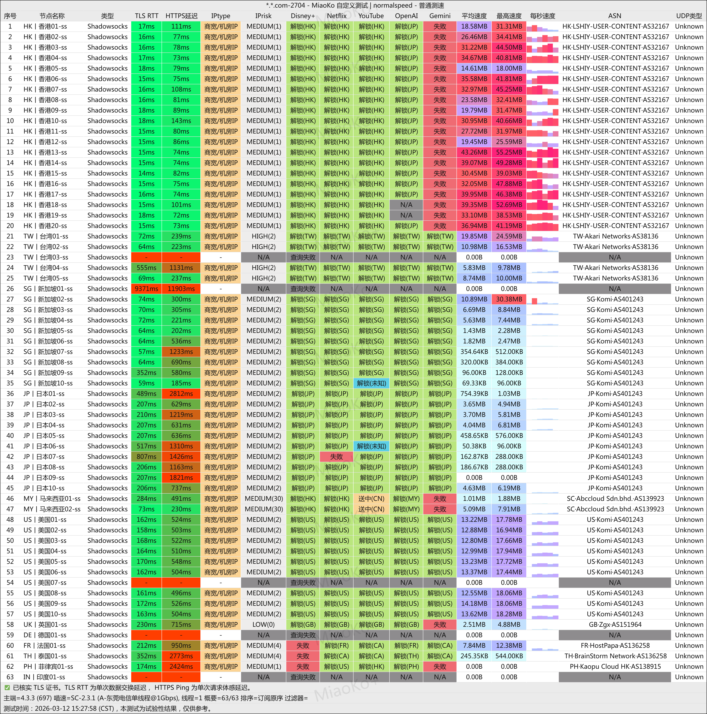

# 唯兔云（WeituYun）最新官网地址说明与平台使用指南

**唯兔云（WeiTuYun）** 是一家由海外团队运营的跨境网络加速服务商，成立于 2025 年，一年多以来稳定运行。 采用 **SS 协议 + 全 IPLC 专线** 架构，不限速、不限制客户端数量的高速连接体验。

唯兔云支持 Netflix、Disney+ 等海外流媒体，支持 ChatGPT 等 AI 工具的访问，兼容常见的客户端，支持一键导入。

> 本仓库用于整理**唯兔云（WeiTuYun）** 的官网注册入口、套餐信息、节点概览、多平台使用指引及常见问题，仅汇总公开信息，请以官网公布为准。 
> 
> **最后更新**：2026 年 4 月 3 日

---

## 快速入口

- 👉 **唯兔云 WeiTuYun 官网注册入口**：  
  [https://kkbaike.com/go/weituyun/](https://kkbaike.com/go/weituyun/)

建议在桌面浏览器中打开链接，完成账号注册与套餐选购。

---

## 目录

1. [服务概览与核心特点](#服务概览与核心特点)  
2. [节点覆盖情况与适用场景](#节点覆盖情况与适用场景)  
3. [套餐价格与选购建议](#套餐价格与选购建议)  
4. [优惠活动说明](#优惠活动说明)  
5. [下载测速和流媒体测试](#下载测速和流媒体测试)
6. [平台支持与客户端指引](#平台支持与客户端指引)  
7. [流媒体与 AI 使用体验](#流媒体与-ai-使用体验)  
8. [常见问题 FAQ](#常见问题-faq)  
9. [官方注册入口与使用提示](#官方注册入口与使用提示)

---

## 服务概览与核心特点

唯兔云的核心优势（以官网为准）：

- **协议与线路**：SS 协议 + 全 IPLC 专线，隐秘性强、抗波动能力优秀。  
- **速率与设备政策**：全节点不限速、节点速率 x1；不限制同时在线客户端数量，支持多终端使用。  
- **适用场景**：日常浏览、远程办公、国际流媒体观看、ChatGPT 等 AI 工具访问。  

整体定位：**海外团队运营的高性价比专线服务**，适合追求稳定解锁与长期使用的用户。

---

## 节点覆盖情况与适用场景

### 节点区域覆盖（以官网为准）

唯兔云节点布局丰富，亚洲节点占比高，典型覆盖包括：

- **亚洲**：香港×20、台湾×10、日本×10、新加坡×10、马来西亚×1、菲律宾×1、泰国×1、越南×1、韩国×1  
- **美洲**：美国×10、阿根廷×1  
- **欧洲**：德国×1、英国×1、法国×1  

**使用建议**：  
- 日常主力：优先香港 / 台湾 / 日本 / 新加坡 等低延迟节点；  
- 跨区/特定解锁：美国节点适合 Netflix 等美区服务；  
- 冷门地区节点适用于工具性需求，不建议长期主力使用。

---

## 套餐价格与选购建议

当前套餐概览（价格/流量以官网实时为准，所有套餐享全 IPLC 专线、原生 IP 解锁、不限速、不限设备）：

| 套餐名称           | 价格              | 月流量       | 特点与适用场景                          |
|--------------------|-------------------|--------------|-----------------------------------------|
| 年付版            | ¥79.90 / 年      | 45GB        | 爆款轻量套餐，适合新闻/查资料/写论文等轻度用户 |
| 入门版            | ¥14.90 / 月      | 100GB       | 入门优选，日常浏览 + 视频入门           |
| 进阶版            | ¥29.90 / 月      | 200GB       | 中度主力，多设备 + 流媒体               |
| 专业版            | ¥59.90 / 月      | 500GB       | 高流量需求，适合重度视频/AI 使用        |
| 至尊版            | ¥119.90 / 月     | 1TB         | 大流量旗舰，多终端共享                  |
| 永久不限时        | ¥340.00 / 一次性 | 500GB（永久）| 一次性付费，永久可用（可重置流量）      |

**选购建议**：  
- 轻度/备用：年付版 或 入门版；  
- 日常主力：进阶版起步；  
- 多设备/高强度：专业版或以上；  
- 长期重度：至尊版或永久包。

> 注意：流量每月/周期重置（永久包可手动重置），实际速度受本地网络影响。

---

## 优惠活动说明

暂未有新活动

唯兔云提供阶梯式长周期折扣，**无需额外码**，支付时自动应用：

- 1 年付：8 折  
- 2 年付：7 折  
- 3 年付：6 折  

> 如遇节日活动，可在基础折扣上继续享受额外优惠。建议根据需求选择周期，尽量避免盲目长付。

---

## 下载测速和流媒体测试

> 测试时间：2026-03-12，网络：电信 1Gbps（单线程）

## 平台支持与客户端指引

唯兔云支持主流平台（以官网及公开反馈为准）：

- **桌面端（Windows / macOS / Linux）**：Clash Verge Rev、Clash for Windows、v2rayN 等（Trojan 兼容）。  
- **移动端**：  
  - iOS：Shadowrocket、Stash、Quantumult X、Surge 等（合规渠道获取）；  
  - Android：Clash for Android、v2rayNG 等。  

**订阅导入通用步骤**：登录官网 → 获取订阅链接 → 在客户端导入 → 测试节点连接。

> 客户端获取及配置请参考官网，避免不明来源下载。

---

## 流媒体与 AI 使用体验

唯兔云原生 IP 深度优化（实际以当时为准）：

- **流媒体**：原生解锁 Netflix、Hulu、HBO、Disney+、HUGO 等，支持高清/4K（取决于本地带宽）。  
- **AI 工具**：稳定解锁 ChatGPT、TikTok 等，长会话表现良好。

---

## 常见问题 FAQ

**Q1：是否限制设备数量？**  
A：不限制，支持多设备同时在线，适合家庭共享。

**Q2：适合高峰期使用吗？**  
A：全 IPLC 专线设计，晚高峰稳定性较好。

**Q3：流量如何重置？**  
A：月付/年付按周期自动重置；永久包手动重置。

**Q4：解锁情况稳定吗？**  
A：原生 IP 优化，主流平台解锁良好，但随平台政策可能变化。

**Q5：如何获得支持？**  
A：客服全天在线，优先通过官网工单或帮助中心反馈。

---

## 官网注册入口与使用提示

- 👉 **唯兔云 官方注册入口**：  
  [https://kkbaike.com/go/weituyun/](https://kkbaike.com/go/weituyun/)

> 请严格遵守相关法律法规，勿用于非法用途。
